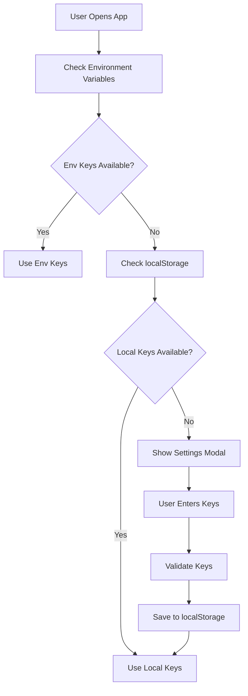

# API Key Storage & Management

## Overview

Fire Enrich uses a client-side API key storage system that provides a secure and user-friendly way to manage API keys without requiring manual `.env` file editing.

## How It Works

### 🔐 **Local Storage**
- API keys are stored in the browser's `localStorage`
- Keys persist between browser sessions
- Each user's keys are stored locally on their machine
- Keys are NOT shared between users or sent to any server

### 🔑 **Supported Providers**
- **Firecrawl** (Required) - Web scraping and search
- **OpenAI** (Required) - GPT models for data enrichment
- **Anthropic** (Optional) - Claude models
- **DeepSeek** (Optional) - DeepSeek models
- **Grok** (Optional) - xAI Grok models

### 💾 **Storage Location**
```
localStorage keys:
- firecrawl_api_key
- openai_api_key
- anthropic_api_key
- deepseek_api_key
- grok_api_key
- selected_llm_provider
- selected_llm_model
```

## User Experience

### ✅ **For End Users**
1. **No Technical Setup**: Users don't need to edit `.env` files
2. **UI-Based Configuration**: All API keys entered through Settings modal
3. **Persistent Storage**: Keys saved automatically and persist between sessions
4. **Privacy**: Keys stored locally, never shared
5. **Easy Management**: Clear individual keys or all keys at once

### 🔧 **For Developers**
1. **Fallback System**: Environment variables still work as fallback
2. **Header-Based Auth**: API keys passed securely in request headers
3. **Validation**: Real-time API key testing before saving
4. **Type Safety**: Full TypeScript support for API key management

## API Key Flow



## Security Considerations

### ✅ **Secure Practices**
- Keys stored in browser localStorage (client-side only)
- Keys passed in HTTP headers (not URL parameters)
- No server-side storage of user API keys
- Validation before saving

### ⚠️ **User Responsibilities**
- Keep API keys confidential
- Use appropriate API key permissions
- Regularly rotate API keys
- Clear keys when using shared computers

## Implementation Details

### **API Key Manager** (`lib/api-key-manager.ts`)
```typescript
// Get all stored keys
const keys = getStoredApiKeys();

// Save keys
saveApiKeys({ firecrawl: 'fc-...', openai: 'sk-...' });

// Check availability
const status = await getApiKeyStatus();

// Clear all keys
clearStoredApiKeys();
```

### **Settings Modal** (`components/settings-modal.tsx`)
- Tabbed interface for API keys and LLM settings
- Real-time validation with visual feedback
- Password visibility toggles
- Clear all functionality

### **Request Headers**
```typescript
const headers = getApiKeyHeaders();
// Returns:
// {
//   'X-Firecrawl-API-Key': 'fc-...',
//   'X-OpenAI-API-Key': 'sk-...',
//   // ... other keys
// }
```

## Benefits for Repository Distribution

### 🚀 **Easy Deployment**
- Works immediately after `git clone` and `npm install`
- No manual `.env` file creation required
- Users can start using the app right away

### 👥 **Multi-User Friendly**
- Each user manages their own API keys
- No shared configuration files
- Perfect for team environments

### 🔄 **Backward Compatible**
- Environment variables still work as before
- Gradual migration path for existing users
- No breaking changes

## Troubleshooting

### **Keys Not Persisting**
- Check if localStorage is enabled in browser
- Verify not in incognito/private mode
- Clear browser cache and re-enter keys

### **API Key Validation Fails**
- Verify key format is correct
- Check API key permissions
- Ensure sufficient API credits

### **Reset Everything**
- Use "Clear All API Keys" button in Settings
- Or manually clear localStorage in browser dev tools
- Refresh page to start fresh

## Future Enhancements

- [ ] Encrypted localStorage storage
- [ ] API key expiration warnings
- [ ] Usage tracking and limits
- [ ] Import/export key configurations
- [ ] Team key sharing (optional)
