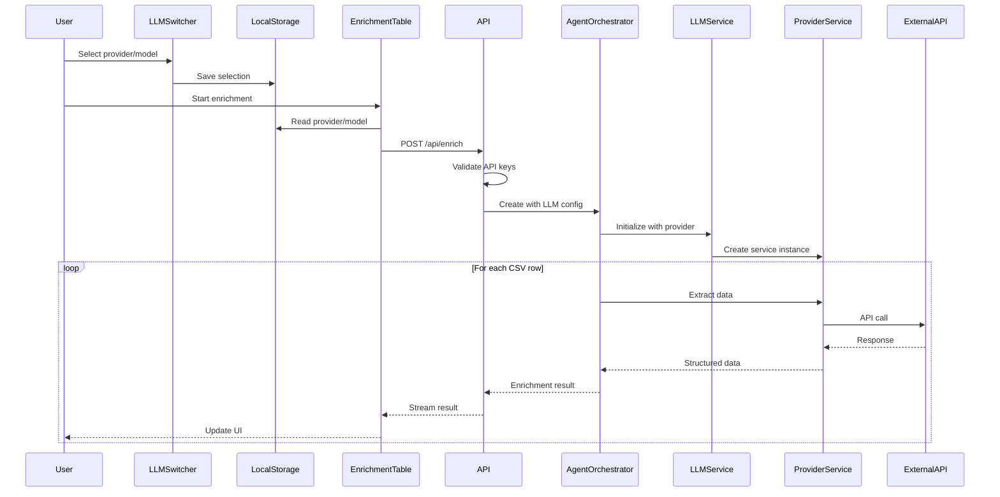
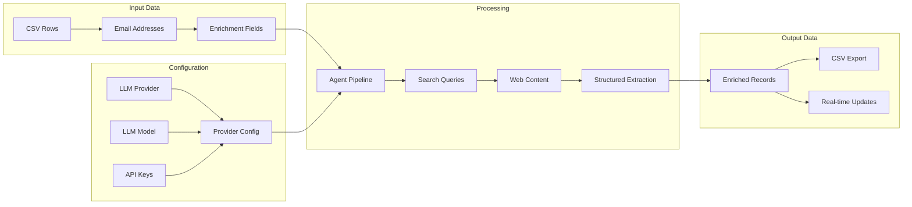
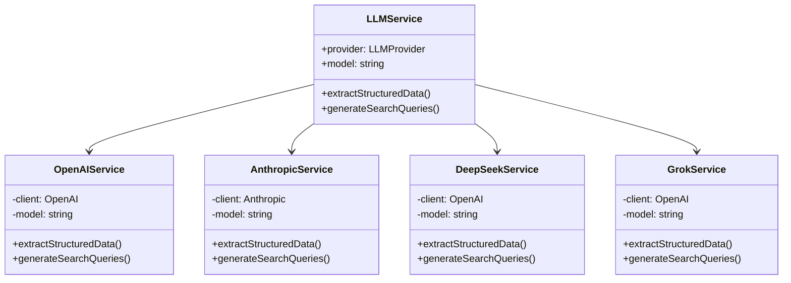
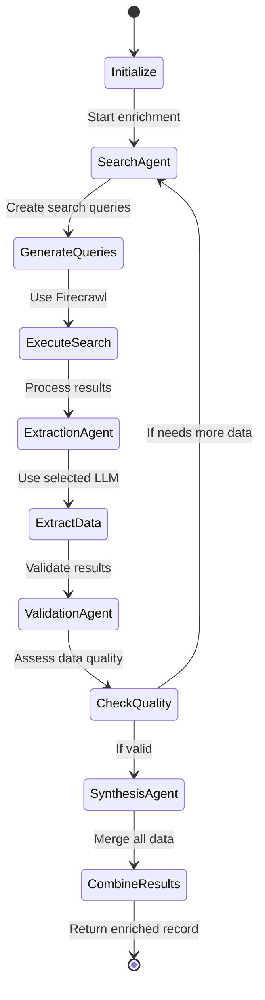
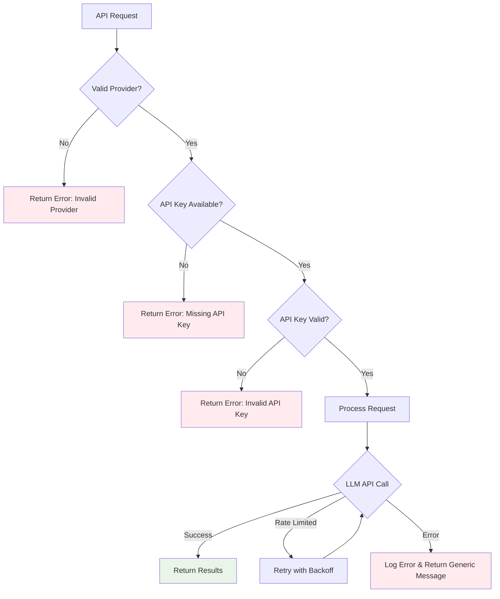
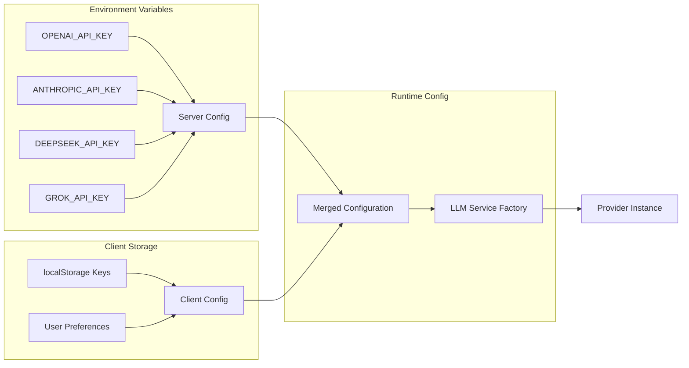
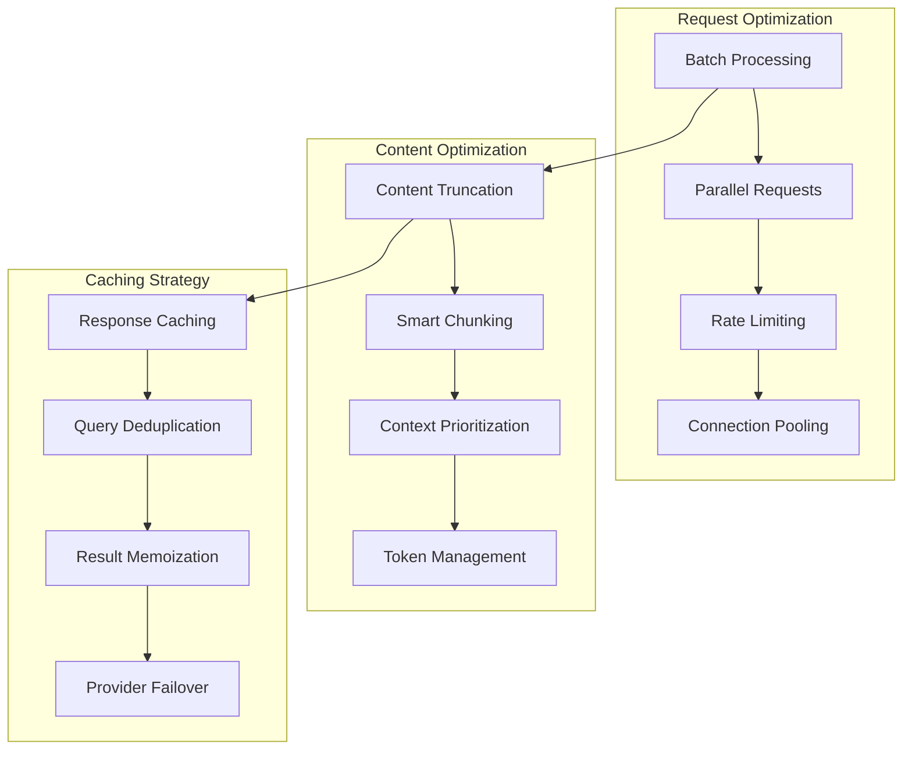
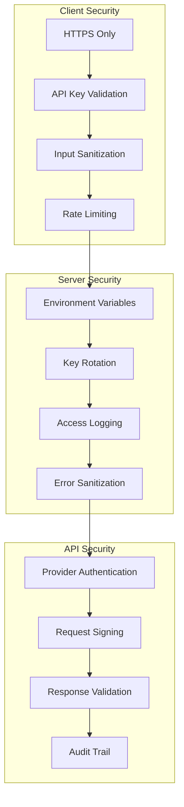
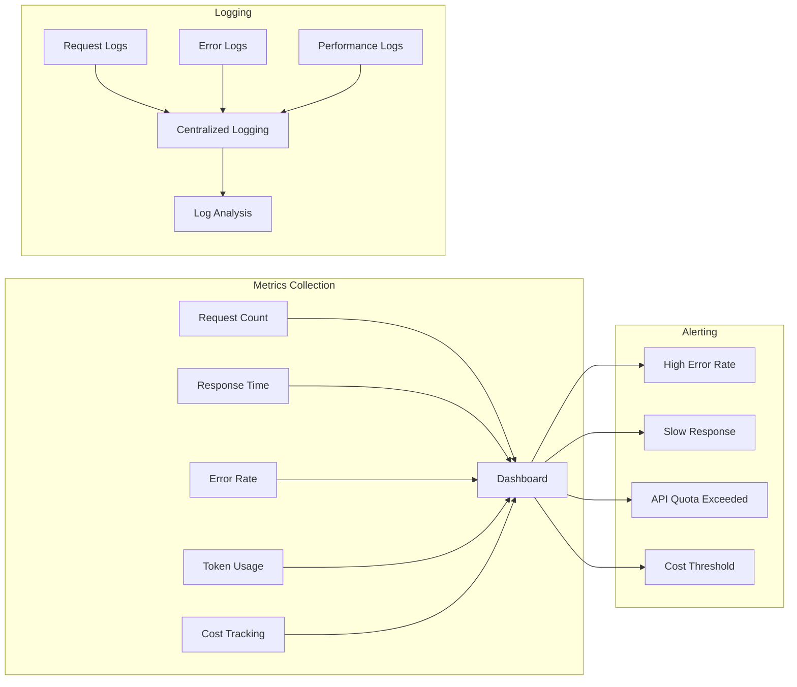
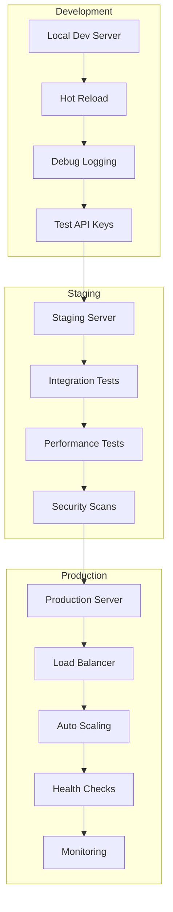

# Fire Enrich LLM Provider Architecture

## System Architecture Diagram

```mermaid
graph TB
    subgraph "Frontend (Next.js)"
        A[LLM Switcher Component] --> B[localStorage]
        B --> C[EnrichmentTable Component]
        C --> D[API Request]
    end
    
    subgraph "API Layer"
        D --> E[/api/enrich Route]
        E --> F[API Key Validation]
        F --> G[Request Processing]
    end
    
    subgraph "Strategy Layer"
        G --> H[AgentEnrichmentStrategy]
        H --> I[AgentOrchestrator]
    end
    
    subgraph "Service Layer"
        I --> J[LLMService]
        J --> K{Provider Selection}
        
        K -->|openai| L[OpenAIService]
        K -->|anthropic| M[AnthropicService]
        K -->|deepseek| N[DeepSeekService]
        K -->|grok| O[GrokService]
    end
    
    subgraph "External APIs"
        L --> P[OpenAI API]
        M --> Q[Anthropic API]
        N --> R[DeepSeek API]
        O --> S[Grok API]
    end
    
    subgraph "Agent Architecture"
        I --> T[SearchAgent]
        I --> U[ExtractionAgent]
        I --> V[ValidationAgent]
        I --> W[SynthesisAgent]
        
        T --> J
        U --> J
        V --> J
        W --> J
    end
    
    style A fill:#e1f5fe
    style J fill:#f3e5f5
    style K fill:#fff3e0
    style L fill:#e8f5e8
    style M fill:#e8f5e8
    style N fill:#e8f5e8
    style O fill:#e8f5e8
```

## Component Interaction Flow



## Data Structure Flow



## Provider Service Interface



## Agent Workflow



## Error Handling Flow



## Configuration Management



## Performance Optimization



## Security Architecture



## Monitoring & Observability



## Deployment Architecture



This architecture documentation provides a comprehensive visual representation of how the LLM provider switching system works, from user interaction through to external API calls and back to the user interface.
