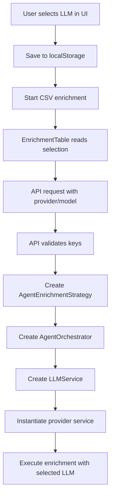

# LLM Provider Switching Documentation

## Overview

Fire Enrich now supports multiple LLM providers for CSV enrichment, allowing users to choose between OpenAI, Anthropic, DeepSeek, and Grok models. This document explains the architecture, implementation, and usage of the LLM provider switching system.

## Supported Providers

| Provider | Default Model | API Base URL | Context Window |
|----------|---------------|--------------|----------------|
| **OpenAI** | `gpt-4o` | `https://api.openai.com/v1` | 128K tokens |
| **Anthropic** | `claude-3-5-sonnet-20241022` | `https://api.anthropic.com` | 200K tokens |
| **DeepSeek** | `deepseek-chat` | `https://api.deepseek.com/v1` | 300K tokens |
| **Grok** | `grok-beta` | `https://api.x.ai/v1` | 250K tokens |

## Architecture Overview

### Frontend Components

1. **LLMSwitcher Component** (`components/llm-switcher.tsx`)
   - Provides UI for selecting LLM provider and model
   - Saves selection to localStorage
   - Checks API key availability for each provider

2. **EnrichmentTable Component** (`app/fire-enrich/enrichment-table.tsx`)
   - Reads selected provider/model from localStorage
   - Sends appropriate API keys in request headers
   - Includes provider/model in API request body

### Backend Architecture

1. **API Route** (`app/api/enrich/route.ts`)
   - Accepts `llmProvider` and `llmModel` parameters
   - Validates API keys for selected provider
   - Creates AgentEnrichmentStrategy with LLM configuration

2. **Agent Architecture** (`lib/agent-architecture/`)
   - **AgentEnrichmentStrategy**: Orchestrates the enrichment process
   - **AgentOrchestrator**: Manages multi-agent workflow with selected LLM
   - **LLMService**: Provides unified interface to all LLM providers

3. **Provider Services** (`lib/services/`)
   - **OpenAIService**: OpenAI GPT models
   - **AnthropicService**: Claude models
   - **DeepSeekService**: DeepSeek models
   - **GrokService**: X.AI Grok models

## Data Flow



## Implementation Details

### Frontend Integration

#### LLM Selection Storage
```typescript
// Saved to localStorage when user switches providers
localStorage.setItem('selected_llm_provider', 'anthropic');
localStorage.setItem('selected_llm_model', 'claude-3-5-sonnet-20241022');
```

#### API Request Format
```typescript
const response = await fetch('/api/enrich', {
  method: 'POST',
  headers: {
    'Content-Type': 'application/json',
    'X-Firecrawl-API-Key': firecrawlApiKey,
    'X-OpenAI-API-Key': openaiApiKey,
    'X-Anthropic-API-Key': anthropicApiKey,
    'X-DeepSeek-API-Key': deepseekApiKey,
    'X-Grok-API-Key': grokApiKey,
  },
  body: JSON.stringify({
    rows,
    fields,
    emailColumn,
    llmProvider: 'anthropic',
    llmModel: 'claude-3-5-sonnet-20241022',
  }),
});
```

### Backend Processing

#### LLM Service Instantiation
```typescript
// In AgentOrchestrator constructor
this.llmService = new LLMService({
  provider: llmProvider,
  apiKey: llmApiKey,
  model: llmModel
});

// LLMService creates appropriate provider service
switch (config.provider) {
  case 'anthropic':
    this.anthropicService = new AnthropicService(config.apiKey, config.model);
    break;
  // ... other providers
}
```

#### Unified Extraction Interface
```typescript
// All providers implement the same interface
const enrichmentResults = await this.llmService.extractStructuredData(
  content,
  fields,
  context
);
```

## Configuration

### Environment Variables
```bash
# Required for Firecrawl
FIRECRAWL_API_KEY=fc-your-key-here

# LLM Provider API Keys (at least one required)
OPENAI_API_KEY=sk-your-openai-key
ANTHROPIC_API_KEY=sk-ant-your-anthropic-key
DEEPSEEK_API_KEY=sk-your-deepseek-key
GROK_API_KEY=xai-your-grok-key

# Optional: Set default provider/model
LLM_PROVIDER=grok
LLM_MODEL=grok-beta
```

### API Key Management

#### Server-side (Environment Variables)
- API keys in environment variables are used by default
- More secure for production deployments

#### Client-side (localStorage)
- API keys can be entered via UI and stored in localStorage
- Useful for development and self-hosted instances
- Keys are sent in request headers to the API

## Usage Guide

### For End Users

1. **Set up API Keys**
   - Add API keys to environment variables, OR
   - Use the "Manage API Keys" button in the UI

2. **Select LLM Provider**
   - Click the LLM switcher in the top-right corner
   - Choose your preferred provider and model
   - The selection is saved automatically

3. **Upload and Enrich CSV**
   - Upload your CSV file
   - Configure enrichment fields
   - Start enrichment - it will use your selected LLM

### For Developers

#### Adding a New LLM Provider

1. **Create Provider Service** (`lib/services/new-provider.ts`)
```typescript
export class NewProviderService {
  constructor(apiKey: string, model: string = 'default-model') {
    // Initialize client
  }

  async extractStructuredData(
    content: string,
    fields: EnrichmentField[],
    context: Record<string, string>
  ): Promise<Record<string, EnrichmentResult>> {
    // Implement extraction logic
  }

  async generateSearchQueries(
    context: Record<string, string>,
    targetField: string,
    existingQueries: string[] = []
  ): Promise<string[]> {
    // Implement query generation
  }
}
```

2. **Update LLMService** (`lib/services/llm-service.ts`)
```typescript
// Add to LLMProvider type
export type LLMProvider = 'openai' | 'anthropic' | 'deepseek' | 'grok' | 'newprovider';

// Add to constructor switch statement
case 'newprovider':
  this.newProviderService = new NewProviderService(config.apiKey, config.model);
  break;

// Add to extractStructuredData method
case 'newprovider':
  return this.newProviderService.extractStructuredData(content, fields, context);
```

3. **Update Frontend** (`components/llm-switcher.tsx`)
```typescript
const LLM_MODELS: LLMModel[] = [
  // ... existing models
  {
    id: 'new-model',
    name: 'New Provider Model',
    provider: 'newprovider',
    cost: 'medium',
    speed: 'fast',
    contextWindow: '100K',
    description: 'Description of new provider',
    available: true,
  },
];
```

4. **Update API Route** (`app/api/enrich/route.ts`)
```typescript
const llmApiKeys = {
  // ... existing providers
  newprovider: process.env.NEWPROVIDER_API_KEY || request.headers.get('X-NewProvider-API-Key'),
};
```

## Testing

### Manual Testing Checklist

- [ ] Switch between all LLM providers in the UI
- [ ] Verify localStorage saves provider selection
- [ ] Test CSV enrichment with each provider
- [ ] Check console logs show correct provider being used
- [ ] Test with missing API keys (should show error)
- [ ] Test with invalid API keys (should show error)
- [ ] Verify enrichment results are consistent across providers

### Automated Testing

```typescript
// Example test for LLM switching
describe('LLM Provider Switching', () => {
  it('should use selected provider for enrichment', async () => {
    // Set provider in localStorage
    localStorage.setItem('selected_llm_provider', 'anthropic');
    localStorage.setItem('selected_llm_model', 'claude-3-5-sonnet-20241022');
    
    // Mock API response
    const mockResponse = { /* enrichment results */ };
    
    // Start enrichment
    const result = await enrichCSV(testData);
    
    // Verify correct provider was used
    expect(mockApiCall).toHaveBeenCalledWith(
      expect.objectContaining({
        llmProvider: 'anthropic',
        llmModel: 'claude-3-5-sonnet-20241022'
      })
    );
  });
});
```

## Troubleshooting

### Common Issues

1. **"Missing API key" error**
   - Ensure API key is set in environment variables OR localStorage
   - Check API key format (each provider has different prefixes)

2. **"Invalid provider" error**
   - Verify provider name is one of: openai, anthropic, deepseek, grok
   - Check for typos in localStorage values

3. **Model not found error**
   - Ensure model name is valid for the selected provider
   - Check provider documentation for available models

4. **Enrichment fails silently**
   - Check browser console for JavaScript errors
   - Verify API keys have sufficient credits/permissions
   - Check network tab for failed API requests

### Debug Information

Enable debug logging by setting:
```bash
DEBUG=fire-enrich:*
```

This will show detailed logs including:
- Selected LLM provider and model
- API key validation results
- Agent execution flow
- Enrichment results per provider

## Performance Considerations

### Provider-Specific Optimizations

- **OpenAI**: Uses `gpt-4o-mini` for simple extractions to reduce costs
- **Anthropic**: Smaller context window, content is trimmed more aggressively
- **DeepSeek**: Cost-effective option with good performance
- **Grok**: Fast inference with competitive context window

### Rate Limiting

Each provider has different rate limits:
- Implement exponential backoff for rate limit errors
- Consider provider-specific delays between requests
- Monitor usage to avoid hitting quotas

## Security Considerations

1. **API Key Storage**
   - Environment variables are preferred for production
   - localStorage keys are sent in headers (HTTPS required)
   - Never log API keys in console or files

2. **Input Validation**
   - Validate provider names against allowed list
   - Sanitize model names to prevent injection
   - Limit content size to prevent abuse

3. **Error Handling**
   - Don't expose API keys in error messages
   - Provide generic error messages to users
   - Log detailed errors server-side only

## Future Enhancements

### Planned Features

1. **Model Performance Analytics**
   - Track accuracy and speed per provider
   - Show cost estimates for enrichment jobs
   - Provider recommendation based on field types

2. **Advanced Configuration**
   - Custom temperature and parameter settings
   - Provider-specific optimization profiles
   - Automatic fallback to secondary providers

3. **Enterprise Features**
   - Team-wide provider preferences
   - Usage analytics and billing integration
   - Custom model fine-tuning support

### Contributing

When contributing to the LLM provider system:

1. Follow the established patterns in existing provider services
2. Add comprehensive tests for new providers
3. Update this documentation with any changes
4. Ensure backward compatibility with existing configurations
5. Test thoroughly with real API keys before submitting PR

## Conclusion

The LLM provider switching system provides a flexible, extensible foundation for supporting multiple AI providers in Fire Enrich. The architecture separates concerns cleanly, making it easy to add new providers while maintaining a consistent user experience.

For questions or issues, please refer to the troubleshooting section or open an issue in the repository.
